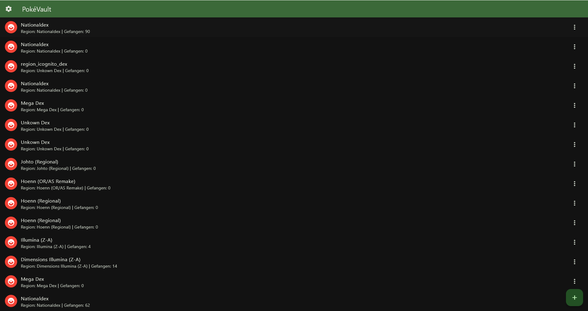
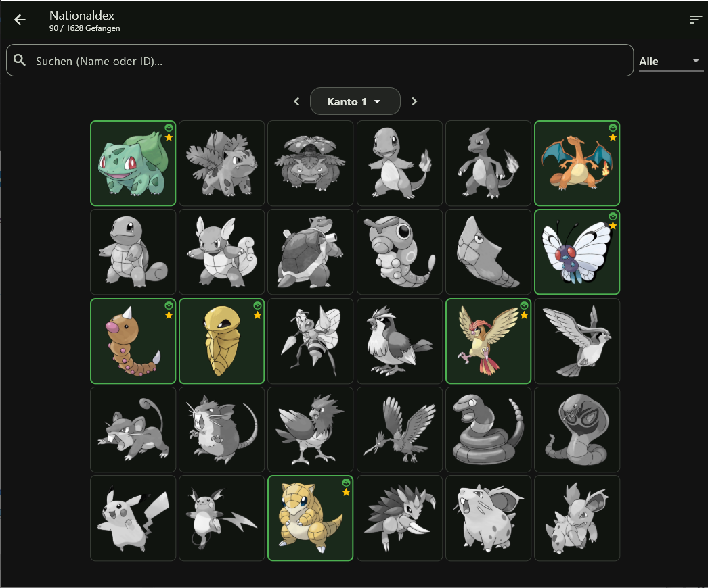
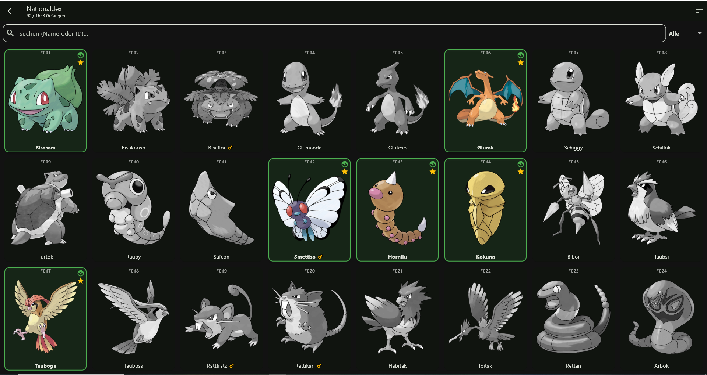
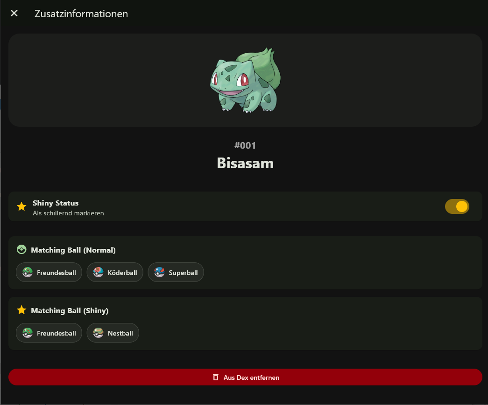
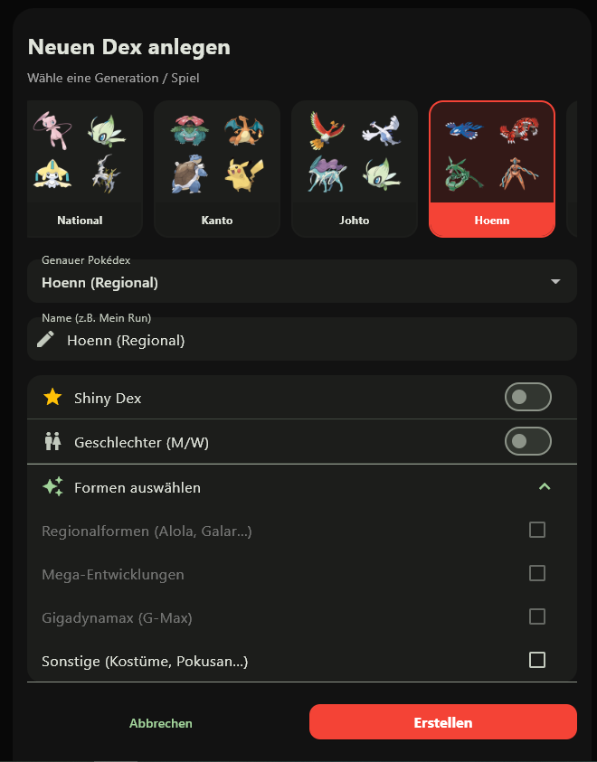
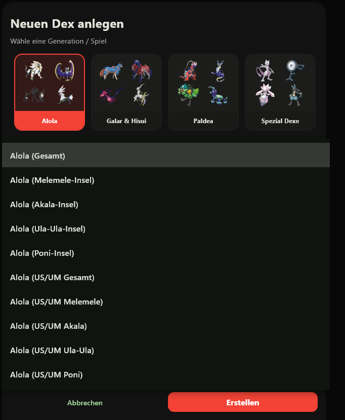

# 🔴 Poké Vault

> **Sprachen:** 🇬🇧 [English](README.md) | 🇩🇪 [Deutsch](README.de.md)

**Poké Vault** ist ein umfassender, vollständig anpassbarer Living Dex Tracker, entwickelt mit Flutter. Egal, ob du einen regionalen Dex, einen nationalen Dex, einen Form-Dex oder einen Shiny-Dex planst – Poké Vault hilft dir dabei, deinen Fortschritt ganz einfach im Blick zu behalten.


## ✨ Features

* **Multi-Dex Verwaltung:** Erstelle beliebig viele Tracker für verschiedene Spiele oder Generationen (z. B. Kanto, Paldea, Rüstungsinsel, Blaubeer-Akademie).
* **Detailliertes Form-Tracking:** Volle Unterstützung für Regionalformen, Mega-Entwicklungen, Gigadynamax und Spezialformen (Pokusan, Vivillon, Icognito etc.).
* **PC-Box & Listen-Ansicht:** Betrachte deine Pokémon im klassischen "PC-Box"-Raster oder in einer detaillierten Liste.
* **Shiny Tracking:** Tracke normale und schillernde (Shiny) Pokémon komplett separat.
* **Passende Pokébälle (Matching Balls):** Erhalte aus der Community kuratierte Empfehlungen für die besten Pokébälle (für die normale *und* die Shiny-Variante)!
* **Volle Personalisierung:** Unterstützt Dark/Light Mode sowie individuell anpassbare Akzent- und Hintergrundfarben.
* **Import & Export:** Sichere deinen Fortschritt ganz unkompliziert über JSON-Dateien und stelle ihn jederzeit wieder her.
* **Mehrsprachig:** Verfügbar auf Deutsch und Englisch.

## 📸 Screenshots

| Home Screen | PC Box Ansicht |
| :---: | :---: |
|  |   |
| **Pokémon Details & Matching Balls** | **Dex Erstellung & Filters** |
|  |   |

## 🚀 Erste Schritte

### Vorraussetzungen
* [Flutter SDK](https://flutter.dev/docs/get-started/install) (Version 3.x)
* Dart SDK

### Installation
1. Repository klonen:
   ```bash
   git clone https://github.com/yourusername/pokevault.git
   ```

2. In das Verzeichnis wechseln:
   ```bash
   cd pokevault
   ```

3. Abhängigkeiten herunterladen:
   ```bash
   flutter pub get
   ```

4. App starten:
   ```bash
   flutter run
   ```

## 🛠️ Daten-Generierung (Intern)
Die App nutzt Python- und Dart-Skripte, um statische Dart-Daten aus externen Quellen (z. B. PokeAPI und eine Excel-Tabelle für Matching Balls) zu generieren.
Um die lokale Datenbank zu aktualisieren, kannst du die Skripte im Ordner bin/ ausführen:
- `python bin/generate_matching_balls.py`
- `dart bin/generate_dex.dart`
- `dart bin/generate_orders.dart`

## 🤝 Hilfe benötigt: Fehlende Fundorte (Gen 8+)
Die App zieht sich die Fundorte (Encounters) der Pokémon über die PokéAPI. Da die API jedoch bei Spielen ab Generation 8 extrem lückenhaft ist (Schwert/Schild DLCs, Strahlender Diamant/Leuchtende Perle, Legenden: Arceus, Karmesin/Purpur), fehlen diese Infos oft in der App.

**Du möchtest helfen? So geht's:**
Du musst keinen Code schreiben! Alle fehlenden, falschen oder speziellen Fundorte (z.B. Event-Verteilungen) können ganz einfach in einer JSON-Datei eingetragen werden:
1. Öffne die Datei `bin/custom_encounters.json`.
2. Füge das Pokémon über seine Dex-ID, die Generation, die Edition und den englischen Fundort hinzu (Schau dir am besten die bestehenden Einträge als Muster an).
3. **Bonus-Schritt:** Öffne die Datei `lib/l10n/app_translations.dart` und trage den neuen englischen Ortsnamen samt seinen Übersetzungen in die entsprechenden Sprach-Maps ein (z. B. `_baseLocationTranslationsDe` für Deutsch).
4. Öffne einen Pull Request mit deinen Änderungen.
5. Ich führe das Skript (`dart bin/generate_encounters.dart`) aus, welches deine Daten mit denen der API zusammenführt.

Jede Hilfe ist enorm wertvoll für die Community!

## 🏪 App Store Veröffentlichung
Da ich selbst keine iOS/Mac-Geräte besitze, um die App für Apple-Geräte zu kompilieren, lade ich die Community herzlich dazu ein, dies zu übernehmen! Wenn jemand die App im Apple App Store, Google Play Store oder in alternativen Stores veröffentlichen möchte, habt ihr hiermit meinen vollen Segen.

**Bedingungen für die Veröffentlichung:**
1. Die App muss **100 % kostenlos** bleiben (keine Werbung, keine In-App-Käufe, strikt nicht-kommerziell).
2. Dieses originale GitHub-Repository muss in der Store-Beschreibung als Quelle (Credits) verlinkt/angegeben werden.

## 🙏 Danksagungen & Quellen
Diese App wäre ohne diese großartigen Ressourcen aus der Community nicht möglich gewesen:
- [PokeAPI](https://pokeapi.co/): Basisdaten und offizielle Artworks.
- [Living Dex Inspiration](https://drive.google.com/drive/folders/1jgopfeGuNA8oJX6mnYearpnNti4a8W-v): Community Google Sheets als Tracker-Basis.
- [Matching Balls Guide](https://docs.google.com/spreadsheets/d/1bvIx7Q2Lxp7efHRrUh48WkuwirNlKardwSHVz_R8kA0/edit?gid=877479959#gid=877479959): Community-kuratierte Excel-Tabelle für die perfekten Pokébälle.
- [Google Gemini](https://gemini.google.com): KI-Assistenz beim Programmieren & Refactoring.

## 📄 Lizenz
Dieses Projekt ist lizenziert unter der [Creative Commons Attribution-NonCommercial 4.0 International Lizenz (CC BY-NC 4.0)](LICENSE).

**Haftungsausschluss:** Pokémon und alle zugehörigen Namen sind Marken und © von Nintendo, Creatures Inc., und GAME FREAK inc. Dies ist ein kostenloses, nicht-kommerzielles Fan-Projekt und steht in keinerlei Verbindung zu Nintendo und wird von diesen weder unterstützt noch gesponsert.